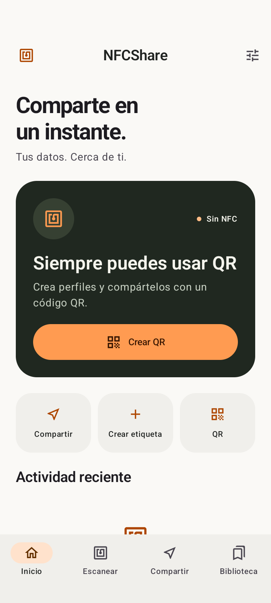
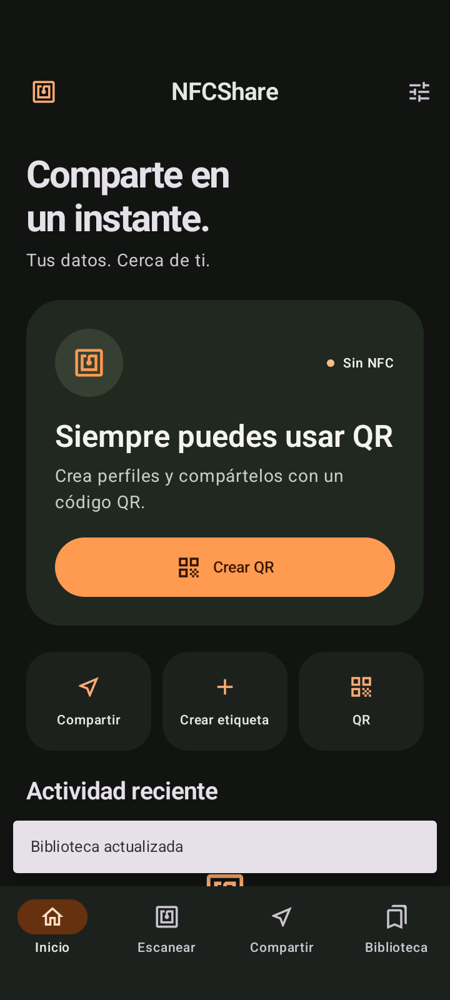
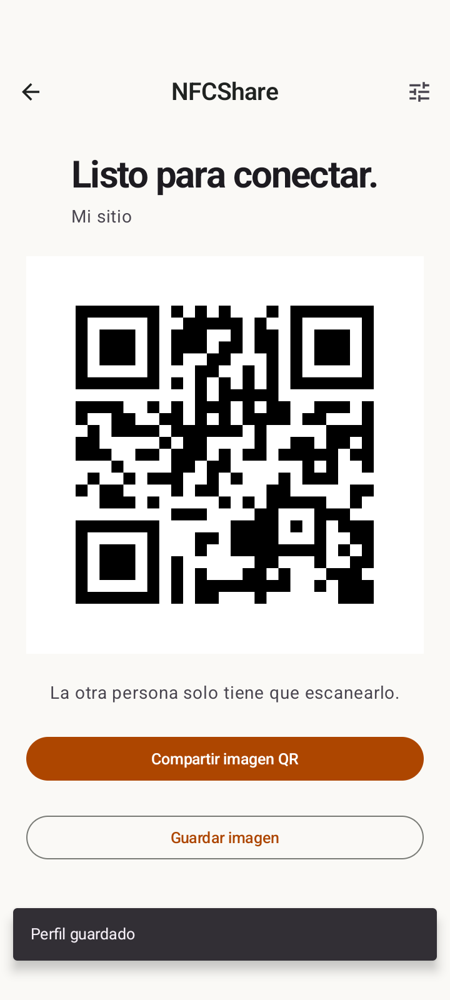

# NFCShare

Una app Android para leer etiquetas NFC públicas, crear contenido NDEF y compartir tus propios datos. Interfaz en español, Material 3, acento naranja, funcionamiento local y Android 16 como plataforma objetivo.

## Capturas reales

Capturadas durante la prueba de interfaz en un emulador Android 16. El emulador no tiene radio NFC.

<p>
  
  
  
</p>

## Descargar el APK

En [Actions → Build Android APK](https://github.com/joelhuevadas-creator/NFCShare/actions/workflows/build-apk.yml), abre la última ejecución exitosa y descarga **Artifacts → NFCShare-debug**. Descomprime el archivo para obtener `app-debug.apk`. GitHub puede solicitar iniciar sesión para descargar artifacts. Es una compilación de depuración, no una versión firmada para Google Play.

## Funciones

- Detecta hardware NFC y estado de activación; QR y biblioteca siguen disponibles sin NFC.
- Lee NDEF: texto UTF-8/UTF-16, URI/URL, Smart Poster, MIME, vCard, Wi-Fi WSC, tipos externos y datos desconocidos. Muestra UID, tecnologías expuestas por Android, capacidad, tamaño y estado de escritura.
- Crea texto, enlaces, contactos, Wi-Fi abierta/WPA2-Personal, correo, teléfono, coordenadas y texto personalizado.
- Vista previa del contenido y tamaño; inspección de capacidad, escritura y confirmación explícita antes de escribir. Revalida el contenido antes de reemplazarlo y verifica la lectura tras escribir etiquetas NDEF existentes.
- Formatea etiquetas `NdefFormatable` solo tras confirmación. Su capacidad no está disponible antes del formateo; se comunica esta limitación en pantalla.
- Perfiles editables, QR reales con ZXing, exportación PNG a Imágenes/NFCShare y Android Share Sheet.
- HCE exclusivo para datos propios con AID `F04E46435348415245`, lector compatible integrado y sesiones de cinco minutos.
- Room: historial, etiquetas guardadas y perfiles, con búsqueda, filtros, renombrado, favoritos y borrado confirmado.
- Temas claro, oscuro y del sistema; Dynamic Color opcional; vibración, sonido e historial configurables.
- Edge-to-edge con insets, navegación atrás y diseño con ancho máximo para pantallas grandes.

## Requisitos

- Android 10 (API 29) o posterior. Hardware NFC opcional; HCE requiere hardware compatible.
- JDK **17**.
- Android SDK **36** y herramientas de compilación (Gradle instala la versión requerida).
- Android Studio compatible con AGP 8.10.1, por ejemplo Meerkat Feature Drop o posterior.
- Gradle **8.11.1**, incluido mediante wrapper con verificación SHA-256.

## Compilar y verificar

```sh
./gradlew testDebugUnitTest lintDebug assembleDebug
```

En Windows: `gradlew.bat testDebugUnitTest lintDebug assembleDebug`.
Configura `ANDROID_HOME` o `sdk.dir` en un archivo local `local.properties` (excluido de Git). Selecciona JDK 17 como Gradle JDK en Android Studio.

APK: `app/build/outputs/apk/debug/app-debug.apk`.
Informes: `app/build/reports/tests/testDebugUnitTest/` y `app/build/reports/lint-results-debug.html`.

El workflow se ejecuta en cada push a `main`, en pull requests y manualmente. Ejecuta tests, lint y `assembleDebug`, y publica el artifact `NFCShare-debug`.

## Uso

1. **Escanear:** activa NFC y acerca una etiqueta a la antena del teléfono. Abre información técnica para ver los datos públicos. Los enlaces solo se abren si lo decides.
2. **Crear etiqueta:** elige un formato, completa los campos y revisa la vista previa. Pulsa escribir, acerca una etiqueta y confirma la operación manteniéndola junto a la antena.
3. **Compartir:** crea y guarda un perfil. Abre el perfil para ver su QR, compartir mediante otra app, escribir una etiqueta o activar HCE.
4. **HCE:** en el emisor, activa el perfil durante cinco minutos. En el receptor, abre Escanear y activa **Recibir de NFCShare**. Acerca ambos teléfonos desbloqueados. HCE se detiene al entrar al escáner; no es posible leer y emular simultáneamente en el mismo teléfono.
5. **Biblioteca:** busca o filtra elementos y abre uno para renombrar, marcar favorito, compartir o eliminar.

## Arquitectura

```text
app/src/main/java/com/nfcshare/app/
  data/            Room, DAO, repositorio y preferencias
  domain/          modelos y política de escritura
  nfc/             controlador, lector, parser, creador y escritor NDEF
  hce/             sesión en memoria, protocolo APDU y HostApduService
  ui/              ViewModel y navegación Compose
    components/    componentes compartidos
    screens/       pantallas funcionales
    theme/         Material 3 y temas
  utils/           QR, compartir, portapapeles y feedback
```

Las operaciones de NFC y disco se ejecutan fuera del hilo principal. Los callbacks se serializan para evitar lecturas/escrituras simultáneas. Los estados del lector viven en ViewModel; el editor usa estado restaurable. Room expone flujos reactivos. La base de datos está en versión 1; el esquema se incluye en `app/schemas`. Una futura modificación exige una migración explícita; no se usa borrado destructivo como fallback.

## Privacidad y seguridad

No hay permiso de Internet, anuncios, trackers ni analytics. La app solo pide NFC y vibración (sin permisos peligrosos de ejecución). QR se guarda mediante MediaStore sin acceso general al almacenamiento. Android Backup está desactivado.

Los datos se guardan en el almacenamiento privado de la app, protegido por el sandbox de Android. No se añade cifrado propio de base de datos. Las contraseñas de registros Wi-Fi reconocidos se excluyen del historial y guardados. Si creas un perfil Wi-Fi y lo guardas, su contraseña se conserva porque es necesaria para compartirlo. Los QR exportados, portapapeles y las apps receptoras quedan fuera del almacenamiento de NFCShare.

**NFCShare no rompe autenticación, no extrae claves y no copia tarjetas bancarias, títulos de transporte ni credenciales de acceso protegidas.** No ejecuta comandos de esas aplicaciones. Solo el modo explícito Recibir de NFCShare selecciona nuestro AID. Un UID puede ser aleatorio y no acredita identidad ni clonabilidad.

HCE no es un canal cifrado ni autenticado: úsalo para datos que quieras entregar a un lector cercano. Requiere desbloqueo, activación expresa y caduca a los cinco minutos. La sesión solo existe en memoria; reiniciar el proceso la cancela. No utiliza categorías ni AID de pago.

## Límites NFC y Wallet

- Sin NDEF no significa necesariamente protegido: puede ser una etiqueta sin formato, un protocolo propietario o una credencial protegida. La app muestra lo que Android expone y no intenta eludir mecanismos de seguridad.
- HCE usa un **protocolo privado de NFCShare**, no una etiqueta Type 4 NDEF universal. El otro extremo necesita NFCShare o un lector que implemente [el protocolo](docs/HCE.md). El soporte y la posición de las antenas dependen del fabricante.
- Android Beam está obsoleto y no se utiliza.
- Wi-Fi crea WSC para redes abiertas o WPA2-Personal; no configura la conexión automáticamente ni soporta Enterprise/WPA3 exclusivo. vCard se muestra e intercambia como contenido; no requiere permisos de contactos.
- El parser no ejecuta payloads ni abre automáticamente enlaces. MIME binario y datos desconocidos se presentan con una vista hexadecimal acotada. Smart Posters anidados tienen límite de profundidad.
- El tamaño máximo de creación/HCE es 32 KiB; el QR se limita a 2.000 bytes para conservar legibilidad. La capacidad real de cada etiqueta suele ser mucho menor.
- Retirar una etiqueta durante una escritura puede dejar contenido parcial. Ante un error, vuelve a escanear para verificarlo. Para etiquetas recién formateadas, se informa el éxito que devuelve Android; vuelve a escanear para verificarlo.
- Las tarjetas y credenciales de Google Wallet necesitan integración del emisor/operador. Esta app no ofrece una función de copiar a Wallet.

## Pruebas

JUnit y Robolectric cubren parsing NDEF real, conversiones, payloads inválidos, límites de bytes, Wi-Fi TLV, APDU HCE, revocación de sesiones, y persistencia/renombrado/favoritos/borrado selectivo de Room. Consulta [la matriz de verificación física](docs/TESTING.md) para las pruebas que requieren etiquetas y dos teléfonos. Una compilación o un emulador no validan la radio NFC física.

Verificación realizada: **34 tests locales aprobados**, lint sin errores, APK compilado y una prueba de interfaz completa aprobada en API 36 (perfil → vista previa → QR → recreación de pantalla → favorito → temas). El estado de los workflows está disponible en Actions.

## Release: APK y AAB

```sh
./gradlew assembleRelease bundleRelease
```

Sin configuración de firma se generan artefactos release sin firmar. Para firmar, proporciona estas variables desde un entorno seguro o GitHub Secrets:

| Variable | Valor |
| --- | --- |
| `NFC_KEYSTORE_PATH` | Ruta temporal al keystore |
| `NFC_STORE_PASSWORD` | Contraseña del keystore |
| `NFC_KEY_ALIAS` | Alias |
| `NFC_KEY_PASSWORD` | Contraseña de la clave |

Resultados: `app/build/outputs/apk/release/` y `app/build/outputs/bundle/release/`. Nunca subas claves ni contraseñas. Una publicación en Play también requiere revisión de políticas, pruebas físicas, ficha, firma y configuración de la cuenta del desarrollador.

## Referencias técnicas

- [Compatibilidad de Android Gradle Plugin 8.10](https://developer.android.com/build/releases/agp-8-10-0-release-notes).
- [Android NFC](https://developer.android.com/develop/connectivity/nfc).
- [Host Card Emulation en Android](https://developer.android.com/develop/connectivity/nfc/hce).

## Licencia

MIT. Consulta [LICENSE](LICENSE). Las dependencias conservan sus respectivas licencias.
